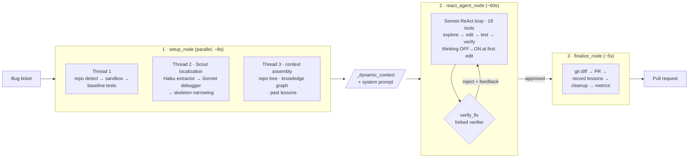

# AI Deploy Agent

**An autonomous bug-fixing agent that turns a bug ticket into a tested pull request — no human in the loop.**

Give it a ticket. It reads the codebase, localizes the fault, writes a minimal fix, generates a reproduction test, runs the suite in an isolated sandbox, has an independent agent verify the change, and opens a PR. It works across Python, JavaScript/TypeScript, Go, and Rust.

This repo is as much about **harness engineering** as it is about the agent: the interesting work is the *system around the LLM* — fault localization, context assembly, sandboxing, verification, observability, and a per-repo learning loop — that turns a general model into a reliable bug-fixer.

> **Status:** active research project (v4, `VERSION 3.5.0`). Honest numbers and methodology are in [Results](#results--methodology) — including what has *not* been run yet.

---

## The core idea: *smart system, free LLM*

Most coding agents sit at two extremes. Pipelines like [Agentless](https://github.com/OpenAutoCoder/Agentless) remove the agent entirely (rigid, one-shot, can't recover). Minimal agents like Mini-SWE-agent give the LLM a bash shell and nothing else (no structural context, no moat).

This harness takes a third position: **the system handles everything that isn't reasoning — orchestration, validation, context assembly, verification — and the LLM reasons and acts freely with 18 tools and no mandated phases.**

The design bet: *don't tell the model how to think — give it the information it needs to think well, and a system that catches its mistakes.*

---

## Architecture

A three-stage pipeline. Setup runs three independent threads in parallel, the agent runs a free-form ReAct loop, and finalize ships the result — all with no LLM in the loop except where reasoning is actually needed.



### Stage 1 — `setup_node` (parallel)
Three independent threads, so setup is ~8s instead of ~15s sequential:
- **Repo + sandbox** — detect language/test-runner, create an isolated git-worktree sandbox, snapshot a **baseline test run** so pre-existing failures are never blamed on the agent's edit.
- **Scout localization** — a 3-agent chain (Haiku entity extractor → Sonnet debugger → skeleton narrowing) produces ranked suspect files *with reasoning*, before the main agent spends a token.
- **Context assembly** — repo tree, knowledge-graph structure (callers/callees/blast radius), and lessons learned from past fixes in this repo.

### Stage 2 — `react_agent_node` (the core)
A Sonnet ReAct loop with **18 tools** and no forced workflow. A ~60-line cached static prompt holds the contracts; a ~150–200 line dynamic block holds the real data about *this* bug. Two engineering details that matter:
- **Thinking inversion** — extended thinking is OFF during exploration (grep/read are mechanical) and flips ON at the first edit (reasoning matters for editing and recovery). Once on, it stays on.
- **Forked verifier** — `verify_fix` forks the conversation so an independent reviewer sees all the agent's reasoning while reusing the cached prefix (cheap). Rejection feeds structured feedback back into the loop; retries happen *in-loop*, not via a separate retry mechanism.

### Stage 3 — `finalize_node`
No LLM. Capture the diff, open the PR, record per-repo lessons, clean up the sandbox, emit metrics.

---

## The 18 tools

| Group | Tools |
|---|---|
| **Explore** (read-only) | `grep_repo`, `read_file`, `read_function`, `list_files`, `get_function_info`, `get_file_structure`, `get_blast_radius` |
| **Cheap explore** | `delegate_explore` — routes broad search to a Haiku subagent (~10× cheaper than Sonnet) |
| **Edit** (sandbox only) | `string_replace`, `create_file`, `undo_last_edit` — auto syntax-check + lint |
| **Plan** | `produce_plan` (optional) |
| **Test** | `run_tests`, `run_shell`, `write_brt` (build a reproduction test) |
| **Complete** | `verify_fix`, `submit_fix`, `escalate` |

---

## Engineering decisions (the interesting part)

These are the choices that make the harness work. Each is a deliberate trade-off, most of them reversals of an earlier, more rigid v3.5 design.

| Decision | What | Why |
|---|---|---|
| **Free-form agent** | No mandated explore→plan→edit→test phases | LLMs don't need a manual; mandates added a 10+ call floor for trivial bugs |
| **Lean prompt** | ~60 lines of contracts + ~200 lines of *data* | Data beats instructions — the old 270-line rulebook made the agent follow rules instead of reasoning |
| **Thinking inversion** | Thinking OFF→ON at first edit | Exploration is mechanical; editing and recovery need reasoning |
| **Forked verifier** | `verify_fix` forks the live conversation | Full context + cached prefix = a cheap, *adversarial* second opinion, not a blind post-hoc check |
| **Anti-rationalization gate** | Verifier that approves with no probe evidence is auto-rejected | Stops rubber-stamp approvals of plausible-but-wrong fixes |
| **Baseline snapshot** | Run tests *before* editing | Distinguishes regressions from pre-existing failures |
| **Haiku for exploration** | `delegate_explore` | ~10× cheaper broad search; Sonnet only where reasoning matters |
| **Knowledge graph** | Neo4j callers/callees/blast radius | Structural context that grep can't give |
| **Per-repo lessons** | `agent_lessons.md` persists across runs | The agent stops repeating the same mistakes in a repo |
| **Shell escape hatch** | non-interactive `run_shell` | Agent can diagnose/repair its own environment (`pip install`, etc.) |
| **Shared-base clone** | clone each repo once, copy per bug | Eliminated the dominant infra failure mode in batch evals |

Rejected (and why) — Docker sandboxing (cold-start + breaks venv access on dev machines), an architect/editor model split (latency/complexity for little gain), and a full tree-sitter repo map in every prompt (too many tokens for repos like Django). See [`docs/v4-complete-agent-reference.md`](docs/v4-complete-agent-reference.md) for the complete decision log.

---

## Observability

Every run emits a structured JSON trace with 17 event types — `llm_response` (per-call input/output/cache tokens, cost, thinking text), `tool_call` (args + the agent's reasoning), `submission_diff`, `verifier_result`, `failure_diagnosis` (failure mode + replay steps), and more. Summary metrics include per-stage token usage, phase breakdown, and `wasted_calls` (repeated reads, grep streaks, test retries).

A React frontend (`TraceLogPanel.tsx`) renders traces live with filters, so a run can be replayed and debugged decision-by-decision. Browse via `GET /api/traces`.

### Measuring what each component is worth (ablation)

A "smart system" claim is only credible if you can show each part earns its place. The harness ships a **component ablation** mode: it runs the eval once with everything on (reference) and once per component with that component disabled, then attributes the pass-rate drop to it — `contribution = pass_rate(full) − pass_rate(full − component)`.

```bash
cd backend && python cli.py eval ablate --sentinel                 # all components
cd backend && python cli.py eval ablate --components scout,verifier # a subset
```

Disabling is centralized in `agent/ablation_flags.py` (a thread-local read at each gate site — Scout, knowledge graph, learning loop, BRT, verifier), so arms never leak state across parallel runs. The output ranks components by contribution and flags any that cost tokens without earning pass rate. *(The framework is built and unit-tested; populating the table requires an eval run with API credits.)*

---

## Results & methodology

> **Read this honestly.** This is a research harness under active iteration. The numbers below are what has actually been measured; where something hasn't been run, it says so.

**Measured to date (across v3.5 → v4 development):**
- **120 bugs attempted**, ~$72 total API spend, **~$0.60 average cost per bug**, ~2.4 min and ~248K tokens per bug.
- On the recent v4 sentinel runs: **100% fault localization** (finds the right file), **100% fix-generation rate**, verifier operating at **0.93 average confidence** with scout hallucinations driven to zero.
- Earlier full-batch run (47 bugs, v3.5): ~21% end-to-end pass rate on bugs that ran, with most non-passes attributable to infra (git clone) and localization — both since addressed.

**Not yet run (and therefore not claimed):**
- A full **300-bug SWE-bench Lite** evaluation. The dataset is in the repo (`eval/swebench_lite.json`), the harness runs it with one command, but the full pass rate is **pending** (est. ~$150 / ~10h). The v4 end-to-end test-pass rate on the larger subsets is the immediate next milestone.

**Reference points** (published SWE-bench Lite numbers, for context — *not* this harness): Augment ~65%, OpenHands ~53%, Moatless ~39%, Agentless ~32%.

Reproducibility: every dataset and the full eval harness are in this repo (`eval/`). See commands below.

---

## Running it

```bash
# Tests (1,170 of them)
python -m pytest backend/tests/ -q

# Bring up Neo4j + backend + frontend
docker-compose up

# Build a knowledge graph for a repo
cd backend && python cli.py build /path/to/repo

# Fix a single bug
cd backend && python cli.py fix TICKET-ID --repo /path/to/repo

# Evaluate
cd backend && python cli.py eval run --sentinel          # fast 5-bug check
cd backend && python cli.py eval run --dataset eval/swebench_50.json
cd backend && python cli.py eval run --dataset eval/swebench_lite.json   # full 300

# UI: http://localhost:5173   API: http://localhost:8001   Neo4j: http://localhost:7474
```

Requires `ANTHROPIC_API_KEY`. Key env vars: `ANTHROPIC_MODEL` (default `claude-sonnet-4-6`), `REACT_THINKING_BUDGET`, `ENABLE_WEB_TOOLS`, `DISABLE_LEARN_FROM_FIX`. Full list in [`docs/v4-complete-agent-reference.md`](docs/v4-complete-agent-reference.md).

---

## Roadmap

- Full 300-bug SWE-bench Lite run with a published, reproducible pass rate
- Run the **ablation** (framework shipped — see above) to publish each component's measured contribution
- Best-of-N multi-patch sampling (framework built, needs eval)
- Monorepo + multi-repo bug support
- Docker sandboxing for multi-tenant production

---

## Tech

Python · FastAPI · Anthropic Claude (Sonnet + Haiku) · Neo4j knowledge graph · React/Vite/TypeScript frontend · Docker · 1,170-test suite.

*Built by [Utkarsh Patidar](https://github.com/codebyutkarsh20).*
